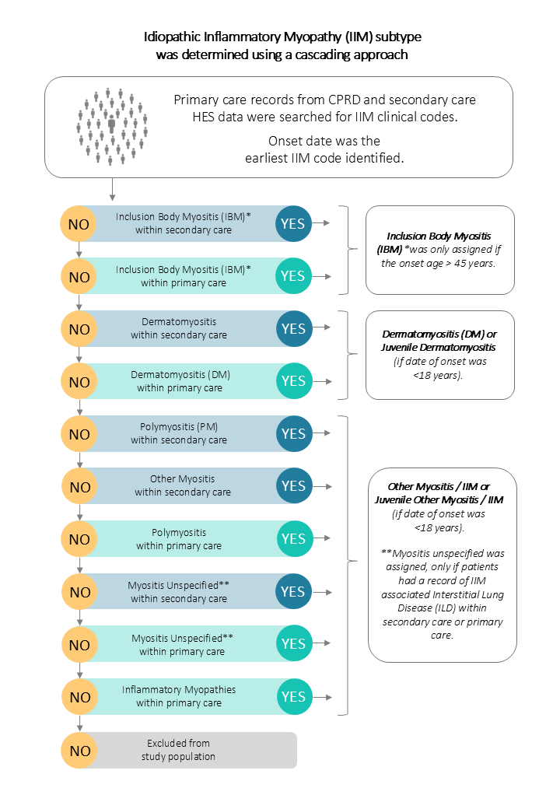

# Diagnostic-Delay-in-IIM
Codelists, exposure/outcome definitions and algorithms for the study titled "The symptom prodrome in idiopathic inflammatory myopathies: A population-based cohort in England 2002-2021"

## Quality Control
All the codelists utilised for data extraction underwent the rigorous quality control process utilised by Momentum Data for multiple real world evidence studies. This process consisted of manual code list generation by a coding expert with a clinical background. The list was then independently reviewed by a second coding expert. The lists then went through an automated quality control process to identify any potential formatting errors or coding inconsistencies. During the data extraction process, high frequency codes were independently reviewed by a third reviewer to ensure that the most commonly used codes correctly match the clinical entity they are being used to identify. A fourth quality control step looks for overlap between code or case definitions where multiple definitions are possible e.g., biochemical disease markers and clinical diagnosis codes for a condition. Finally once variables were generated, the frequency and pattern of variable prevalence was compared with known data from previous analysis in other independent datasets and published literature. Any inconsistencies were reviewed and investigated as appropriate.

## Algorithms for identification
### Idiopathic Inflammatory Myopathy (IIM)
Individuals with IIM were identified and classified into IIM subtypes using a cascading approach based on recorded clinical codes from both primary and secondary care records.

Diagram illustrating the cascading case definition approach can be seen below.

---

For the full list of codes:
- [Dermatomyositis](https://github.com/MomentumData/Momentum-Data-Codelists/tree/af2e2c3c940e90c606a5b6e053d883bed5dd67a2/Conditions/Idiopathic%20Inflammatory%20Myopathies/DM%20(Dermatomyositis))
- [Inclusion Body Myositis](https://github.com/MomentumData/Momentum-Data-Codelists/tree/af2e2c3c940e90c606a5b6e053d883bed5dd67a2/Conditions/Idiopathic%20Inflammatory%20Myopathies/IBM%20(Inclusion%20Body%20Myositis))
- [Other Myositis](https://github.com/MomentumData/Momentum-Data-Codelists/tree/af2e2c3c940e90c606a5b6e053d883bed5dd67a2/Conditions/Idiopathic%20Inflammatory%20Myopathies/Other%20Myositis)
  - [Polymyositis](https://github.com/MomentumData/Momentum-Data-Codelists/tree/af2e2c3c940e90c606a5b6e053d883bed5dd67a2/Conditions/Idiopathic%20Inflammatory%20Myopathies/Other%20Myositis/Polymyositis)
  - [Paraneoplastic Polymyositis](https://github.com/MomentumData/Momentum-Data-Codelists/tree/af2e2c3c940e90c606a5b6e053d883bed5dd67a2/Conditions/Idiopathic%20Inflammatory%20Myopathies/Other%20Myositis/Paraneoplastic%20Polymyositis)
  - [Myositis - Unspecified](https://github.com/MomentumData/Momentum-Data-Codelists/tree/af2e2c3c940e90c606a5b6e053d883bed5dd67a2/Conditions/Idiopathic%20Inflammatory%20Myopathies/Other%20Myositis/Myositis%20-%20Unspecified)
  - [Inflammatory Myopathy](https://github.com/MomentumData/Momentum-Data-Codelists/tree/af2e2c3c940e90c606a5b6e053d883bed5dd67a2/Conditions/Idiopathic%20Inflammatory%20Myopathies/Other%20Myositis/Inflammatory%20Myopathy)
- [IIM associated Interstitial Lung Disease](https://github.com/MomentumData/Momentum-Data-Codelists/tree/af2e2c3c940e90c606a5b6e053d883bed5dd67a2/Conditions/ILD%20(Interstitial%20Lung%20Disease)/IIM%20Associated%20ILD) [(ILD)](https://github.com/MomentumData/Momentum-Data-Codelists/tree/af2e2c3c940e90c606a5b6e053d883bed5dd67a2/Conditions/ILD%20(Interstitial%20Lung%20Disease))

---

## Study Endpoints
### Muscle Weakness
- People identified with a diagnosis code for [muscle weakness](https://github.com/MomentumData/Momentum-Data-Codelists/tree/7b8c674fd7e4498d21127439397af9fa79a1910b/Conditions/Muscle%20Weakness) in primary care.

### Dysphagia
- People identified with a diagnosis code for [dysphagia](https://github.com/MomentumData/Momentum-Data-Codelists/tree/7b8c674fd7e4498d21127439397af9fa79a1910b/Conditions/Dysphagia) or [percutaneous endoscopic gastrostomy feedings](https://github.com/MomentumData/Momentum-Data-Codelists/tree/d60d644da07256610eee96222e503c6dd03b4ec0/Treatments/Percutaneous%20Gastrostomy%20Feedings%20(PEG)) in primary care.

### Joint Pain
- People identified with a diagnosis code for [joint pain](https://github.com/MomentumData/Momentum-Data-Codelists/tree/7b8c674fd7e4498d21127439397af9fa79a1910b/Conditions/Joint%20Pain) in primary care.

### Fatigue
- People identified with a diagnosis code for [fatigue](https://github.com/MomentumData/Momentum-Data-Codelists/tree/7b8c674fd7e4498d21127439397af9fa79a1910b/Conditions/Fatigue) in primary care.

### Elevated Alanine Aminotransferase (ALT)
- People with [ALT measurement](https://github.com/MomentumData/Momentum-Data-Codelists/tree/7b8c674fd7e4498d21127439397af9fa79a1910b/Measurements/Elevated%20Alanine%20Transaminase%20(ALT)) over 70 IU/L recorded in primary care.
